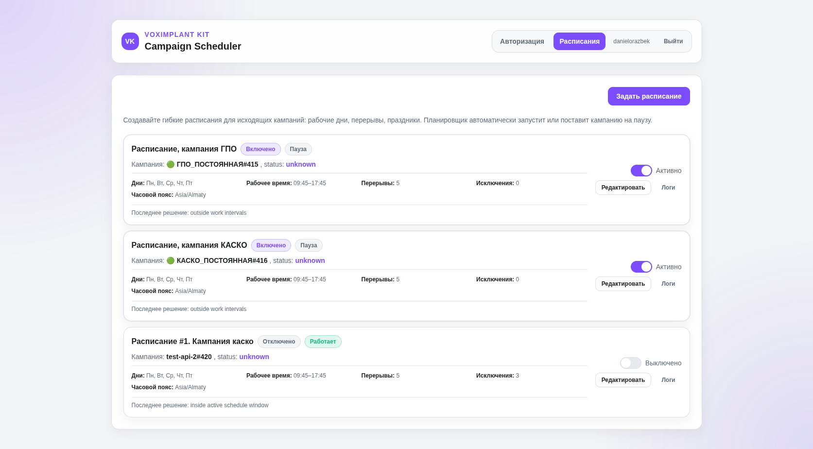
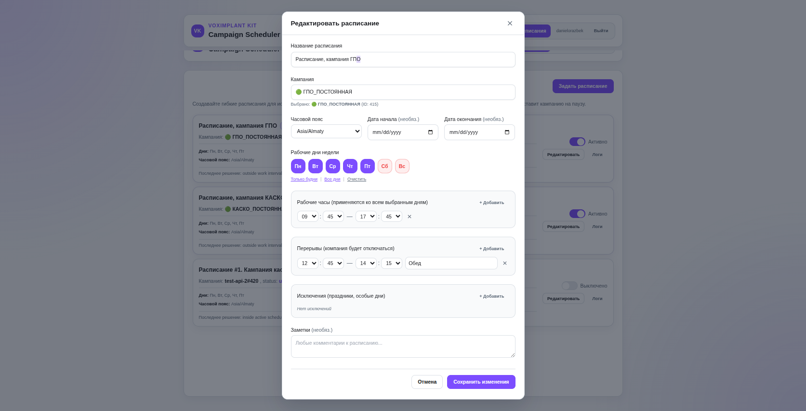

# Voximplant Campaign Scheduler Service

## О сервисе
Сервис расширяет дефолтный функционал графика кампаний в Voximplant Kit. Позволяет клиенту более гибко настраивать дни и время работы. Под капотом использует только API-методы `getaccountinfo`, `search`, `resume`, `pause`.
Другой функционал управления кампаниями, например старт и стоп, специально не добавлен, так как он излишен в рамках задач сервиса.

**Сравнительная таблица**
| Функционал | Этот сервис | Voximplant Kit |
|---|---|---|
| Управление датой старта/окончания кампании | ✅ | ✅ |
| Управление временем начала/окончания | ✅ | ✅ |
| Задать перерыв на обед | ✅ | ✖ |
| Задать работу только в будни | ✅ | ✖ |
| Задать работу только в определенные дни недели | ✅ | ✖ |
| Задать праздничные дни | ✅ | ✖ |

## Интерфейс: Раздел расписаний


## Интерфейс: Создание/редактирование расписаний



## Демо сервиса

- Демо-стенд: https://kit-campaign-scheduler.digital-universe.xyz


## Архитектура

**Архитектура:**
Production stack состоит из пяти сервисов: `gateway`, `frontend`, `backend`, `postgres`, `redis`.
Единственная опубликованная точка входа приложения — `192.168.50.111:4000`, ведущая в HTTP gateway.

**Техстек:**
- Frontend: React + TypeScript + Vite + Tailwind CSS
- Backend: NestJS + Prisma
- БД: PostgreSQL
- Кэш/очереди: Redis
- Деплой: Docker + Docker Compose

**Требования:**
- Node.js 20.20.2+ (для локальной разработки в корне лежит [.nvmrc](.nvmrc))
- npm
- Docker с поддержкой Docker Compose

## Эксплуатационная архитектура

### Что делает каждый компонент

- `frontend`: UI для управления расписаниями, настройками интеграции и просмотром логов.
- `backend`: API, валидация расписаний, авторизация, применение `pause/resume` в Voximplant.
- `postgres`: источник истины для пользователей, интеграции, расписаний и журнала действий.
- `redis`: служебный инфраструктурный компонент для кеша/очередей (подключен в окружении).
- `gateway`: внутренний HTTP gateway на Caddy; проксирует `/api` и `/api/*` в backend, остальной трафик во frontend.

### Production topology

```text
Internet
  |
  | HTTPS
  v
External Caddy VM (192.168.50.112)
  |
  | HTTP, private LAN
  v
Application VM (192.168.50.111:4000)
  |
  v
Internal gateway:80
  |-- /api, /api/* --> backend:4000
  |                       |-- postgres:5432
  |                       `-- redis:6379
  `-- everything else -> frontend:80
```

- Домен: `kit-campaign-scheduler.digital-universe.xyz`.
- TLS, сертификаты и HTTP-to-HTTPS redirect обслуживает только внешний Caddy.
- Project-level gateway работает только по HTTP и не хранит TLS-сертификаты.
- Frontend обращается к API через same-origin путь `/api`.
- Стандартные `Host`, `X-Forwarded-For`, `X-Forwarded-Proto` и `X-Forwarded-Host` проходят через оба Caddy. Internal gateway доверяет этим заголовкам только от `192.168.50.112`, а NestJS настроен на работу за trusted proxies.

### Docker networks

| Network | Members | Internet egress | Purpose |
| --- | --- | --- | --- |
| `web-network` | gateway, frontend, backend | yes | HTTP routing и outbound-доступ backend к Voximplant API |
| `data-network` (`internal`) | backend, postgres, redis | no через эту сеть | Изолированный доступ к PostgreSQL и Redis |

Backend подключен к обеим сетям, поэтому доступ к данным изолирован, а исходящий интернет сохраняется через `web-network`.

### Security boundaries

```text
Internet -> External Caddy :80/:443                    ALLOW
Internet -> Application VM 192.168.50.111:4000         BLOCK / NO NAT
External Caddy 192.168.50.112 -> 192.168.50.111:4000   ALLOW
Application VM -> Internet via NAT                     ALLOW
```

На Application VM firewall рекомендуется разрешить TCP/4000 только от `192.168.50.112`. Настройка firewall не входит в Docker stack.

### Цикл работы планировщика

- В backend запущен внутренний тикер (интервал 10 секунд).
- На каждом тике сервис удаляет просроченные мягко удаленные расписания.
- На каждом тике сервис обрабатывает активные расписания и вычисляет целевое состояние кампании (`paused` или `resumed`).
- При необходимости сервис отправляет запросы `pause/resume` в Voximplant API.

## Формат БД (основные сущности)

Источник схемы: `apps/backend/prisma/schema.prisma`.

- `User`: пользователи, статус активности, флаг обязательной смены пароля, счетчик неудачных входов, блокировка.
- `UserSession`: refresh-сессии, срок жизни, признак отзыва, IP/User-Agent.
- `IntegrationSettings`: домен/host Voximplant, шифрованный токен, статус и результаты верификации.
- `Schedule`: карточка расписания кампании (campaignId, TZ, диапазон дат, флаги `isEnabled`/`isDeleted`).
- `ScheduleWeekday`: включенные дни недели для расписания.
- `ScheduleWorkInterval`: рабочие интервалы по дням недели.
- `ScheduleBreakInterval`: интервалы перерывов по дням недели.
- `ScheduleException`: исключения (выходной или кастомные рабочие часы, включая ежегодную повторяемость).
- `ScheduleRuntimeState`: последнее вычисленное состояние планировщика (`paused`/`resumed`/`unknown`) и причина решения.
- `ScheduleActionLog`: аудит действий (manual/scheduler/system), статус, ошибки и payload ответов API.

## Поддержка и восстановление при сбоях

### Базовая диагностика

- Проверить статус контейнеров: `docker compose ps`.
- Проверить логи backend: `docker compose logs -f backend`.
- Проверить ingress на Application VM: `curl http://192.168.50.111:4000/`.
- Проверить API health через весь ingress: `curl http://192.168.50.111:4000/api/health`.
- Проверить доступность БД: `docker compose exec postgres pg_isready -U "$POSTGRES_USER" -d "$POSTGRES_DB"`.

### Если backend не стартует

- Частая причина: невалидные или пустые секреты в `.env` (`JWT_ACCESS_SECRET`, `JWT_REFRESH_SECRET`, `TOKEN_ENCRYPTION_KEY`).
- Частая причина: ошибка миграций Prisma в `docker-entrypoint.sh`.
- Действия: обновить `.env` и пересоздать backend: `docker compose up -d --force-recreate backend`.
- Действия: при миграционных ошибках проверить SQL в папке `apps/backend/prisma/migrations` и повторить `docker compose up -d --build`.

### Если расписания не применяются к кампаниям

- Проверить валидность интеграции в настройках (домен/host/access token).
- Проверить журнал действий по расписанию (`ScheduleActionLog`) и ошибки Voximplant API в логах backend.
- Проверить, что расписание включено (`isEnabled=true`) и не удалено (`isDeleted=false`).

### Если сервис временно недоступен

- Кампании остаются в последнем фактически примененном состоянии во внешней системе.
- После восстановления backend планировщик продолжит обработку на следующем тике.

## Известное ограничение

- Сервис вычисляет целевое состояние по расписанию и хранит его во внутреннем `runtimeState`.
- Если кампанию вручную перевели в другой статус во внешней системе между тиками, сервис не гарантирует немедленный возврат в нужное состояние до следующего цикла принятия решения.


## Запуск через Docker Compose

1. Создаем файл окружения:

```bash
cp .env.example .env
```

2. Генерируем секреты для `.env`:
```bash
sed -i "s|^JWT_ACCESS_SECRET=.*|JWT_ACCESS_SECRET=$(openssl rand -hex 64)|" .env && \
sed -i "s|^JWT_REFRESH_SECRET=.*|JWT_REFRESH_SECRET=$(openssl rand -hex 64)|" .env && \
sed -i "s|^TOKEN_ENCRYPTION_KEY=.*|TOKEN_ENCRYPTION_KEY=$(openssl rand -hex 32)|" .env
```

3. На Application VM `192.168.50.111` собираем и запускаем все сервисы:

```bash
docker compose up -d --build
```

Значение `HOST_BIND_IP=192.168.50.111` требует, чтобы этот IP был назначен сетевому интерфейсу текущей машины. На ноутбуке или другой VM Docker вернет `bind: can't assign requested address`.

Для локальной проверки production stack используйте loopback override, не изменяя production-значение в `.env`:

```bash
HOST_BIND_IP=127.0.0.1 docker compose up -d --build
curl -fsS http://127.0.0.1:4000/
curl -fsS http://127.0.0.1:4000/api/health
```

4. Миграции Prisma теперь применяются автоматически при старте backend-контейнера.

При `docker compose up -d --build` backend сначала выполняет `prisma migrate deploy`, и только потом запускает HTTP-сервер NestJS.
Если миграция завершается ошибкой, контейнер backend не стартует (это нормальное защитное поведение).

5. Compose публикует ровно один порт:

```text
192.168.50.111:4000 -> gateway:80
```

`frontend`, `backend`, `postgres` и `redis` host ports не публикуют. Значения bind задаются через `HOST_BIND_IP` и `HOST_HTTP_PORT` в `.env`.

6. Настройте внешний Caddy на VM `192.168.50.112`:

```caddyfile
kit-campaign-scheduler.digital-universe.xyz {
  reverse_proxy 192.168.50.111:4000
}
```

Внешний Caddy завершает TLS и управляет сертификатами. В repository и production Compose он не входит.

7. Проверка после запуска:

```bash
curl -fsS http://192.168.50.111:4000/
curl -fsS http://192.168.50.111:4000/api/health
```


## Локальный запуск (без докеров)

> Перед установкой зависимостей активируйте Node 20.20.2 через `nvm use`.

1. Создаем файлы окружения:

```bash
cp .env.example .env
cp apps/frontend/.env.example apps/frontend/.env
```

2. Генерируем секреты:

```bash
sed -i "s|^JWT_ACCESS_SECRET=.*|JWT_ACCESS_SECRET=$(openssl rand -hex 64)|" .env && \
sed -i "s|^JWT_REFRESH_SECRET=.*|JWT_REFRESH_SECRET=$(openssl rand -hex 64)|" .env && \
sed -i "s|^TOKEN_ENCRYPTION_KEY=.*|TOKEN_ENCRYPTION_KEY=$(openssl rand -hex 32)|" .env
```

3. Устанавливаем зависимости:

```bash
npm install
```

Проверка сборки локально:

```bash
npm run build
```

4. Поднимаем локальную БД и применяем миграции:

```bash
npm run db:up
npm run db:migrate
```

5. Запускаем backend:

```bash
CORS_ORIGIN=http://localhost:5173 npm run dev:backend
```

Backend API:

```text
http://localhost:4000/api
```

6. Запускаем frontend:

```bash
npm run dev:frontend
```

Frontend:

```text
http://localhost:5173
```


## Команды работы с пользователями

### Пример регистрации нового пользователя через API:

1. Сначала нужно разрешить публичную регистрацию. По умолчанию этот метод отключен, чтобы избежать абьюза этого API-метода.
```bash
sed -i 's/^AUTH_ALLOW_PUBLIC_REGISTRATION=.*/AUTH_ALLOW_PUBLIC_REGISTRATION=true/' .env
docker compose up -d --force-recreate backend
```
2. Далее выполняем API-запрос
```bash
curl -i -sS -X POST 'https://domain.com/api/auth/register' \
  -H 'Content-Type: application/json' \
  -d '{"login":"LOGIN","password":"PASSWORD"}'
```

3. После этого отключите публичную регистрацию:
```bash
sed -i 's/^AUTH_ALLOW_PUBLIC_REGISTRATION=.*/AUTH_ALLOW_PUBLIC_REGISTRATION=false/' .env
docker compose up -d --force-recreate backend
```

Если у пользователя включен обязательный сброс пароля, после входа он будет перенаправлен на `/change-password` и не получит доступ к остальным разделам, пока пароль не будет обновлен.

Пример просмотра существующих пользователей:
```bash
docker compose exec postgres sh -lc 'psql -U "$POSTGRES_USER" -d "$POSTGRES_DB" -c '\''SELECT id, login, "isActive", "createdAt" FROM "User" ORDER BY "createdAt" DESC;'\'''
```

### Смена пароля пользователя
1. Заходим на сервер, где хостим сервер
2. Лезем в докер 
```bash
docker compose exec backend sh
```
3.  Получаем `accessToken`:
```bash
curl -sS -X POST 'http://localhost:4000/api/auth/login' \
  -H 'Content-Type: application/json' \
  -d '{"login":"admin","password":"ТЕКУЩИЙ_ПАРОЛЬ"}'
  ```

4. Копируем оттуда `accessToken`
```bash
curl -sS -X POST 'http://localhost:4000/api/auth/change-password' \
  -H 'Content-Type: application/json' \
  -H 'Authorization: Bearer ACCESS_TOKEN_ИЗ_LOGIN' \
  -d '{"currentPassword":"ТЕКУЩИЙ_ПАРОЛЬ","newPassword":"НОВЫЙ_СЛОЖНЫЙ_ПАРОЛЬ"}'
  ```

5. Готово. В ответе должно вернуться:
```json
{"success":true,"reloginRequired":true}
```

### Требования к сложности нового пароля

Новый пароль должен соответствовать всем условиям:

- минимум 10 символов;
- минимум 1 строчная латинская буква (`a-z`);
- минимум 1 заглавная латинская буква (`A-Z`);
- минимум 1 цифра (`0-9`);
- минимум 1 специальный символ (любой символ, кроме букв и цифр);
- пароль не должен быть слишком распространенным (например: `admin123`, `password`, `password123`, `qwerty`, `qwerty123`, `123456`, `12345678`);
- пароль не должен содержать логин пользователя (без учета регистра).